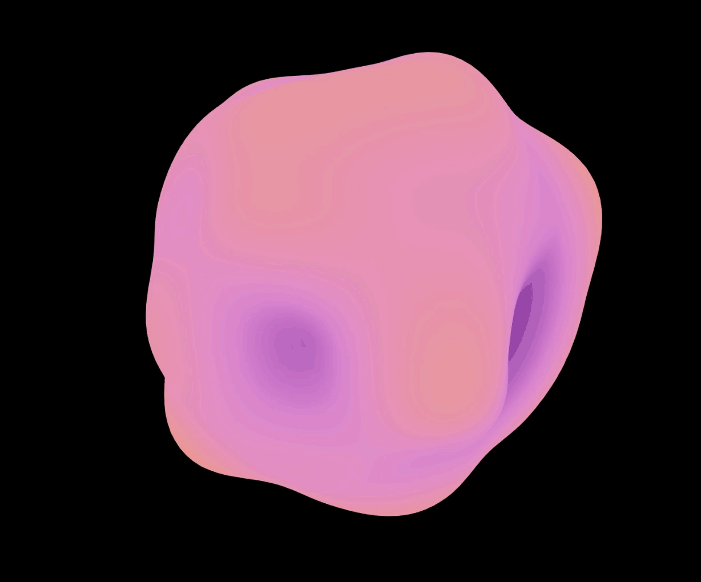
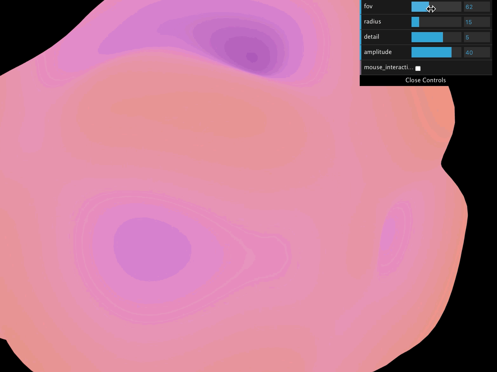
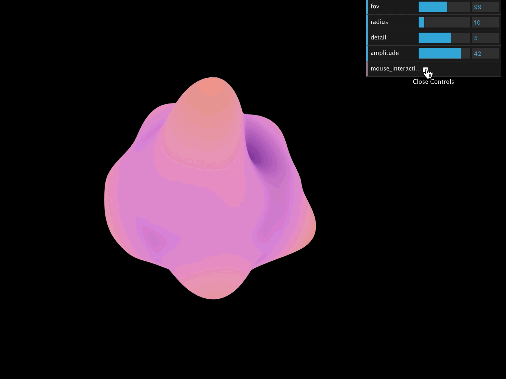

# [Theraputty Visualization](https://anvidalal.github.io/Project1-Noise/)

## Objective

Learn how to write a shader that uses a multi-octave noise algorithm to generate an interesting 3D, continuous surface.

## Inspiration

Theraputty is a silicone material that can be used for a variety of hand exercises. I often find myself playing with it to destress, so I wanted to create a visualization of how it takes shape when it is moulded in someone's hands.

## Process

I started off with adding an icosahedron geometry to my THREE.js scene. I then wrote noise generation, interpolation and fbm functions to generate perlin noise for my vertex shader. Each vertex is raised along its normal to the noise value that I get from my noise function. The noise value is then used to decide what color the fragment will take in the fragment shader.

## Interactivity

Using dat.GUI, I added sliders to affect the geometry of my icosahedron, by changing its radius and detail. I also added a value slider to change how much each vertex should be translated along the noise * normal vector.

I also added mouse interactivity that deforms the cloud away from the cursor when turned on from the dat.gui.

