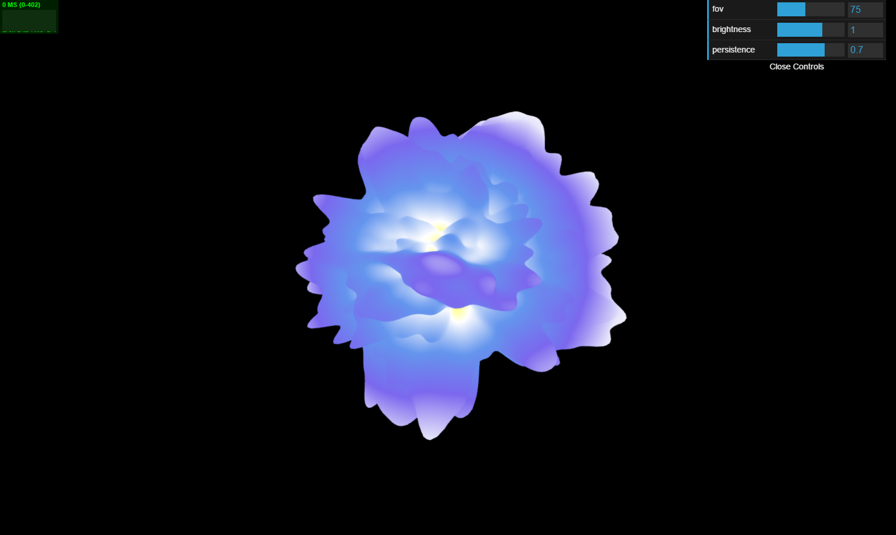
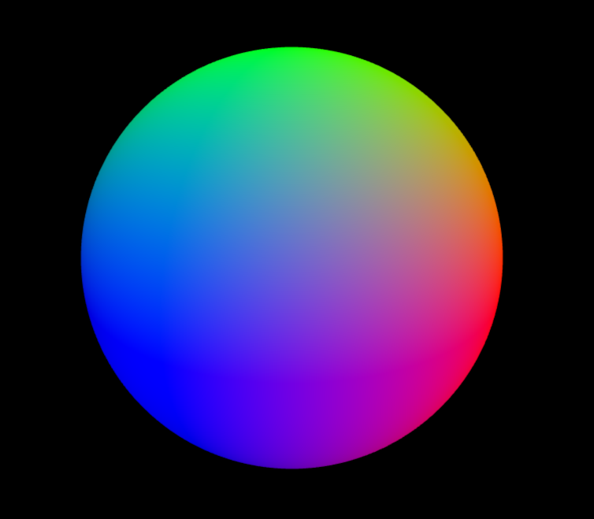
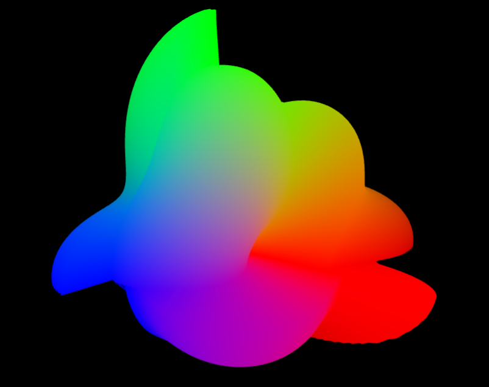
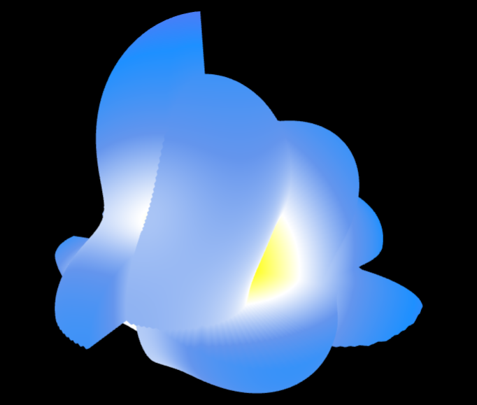
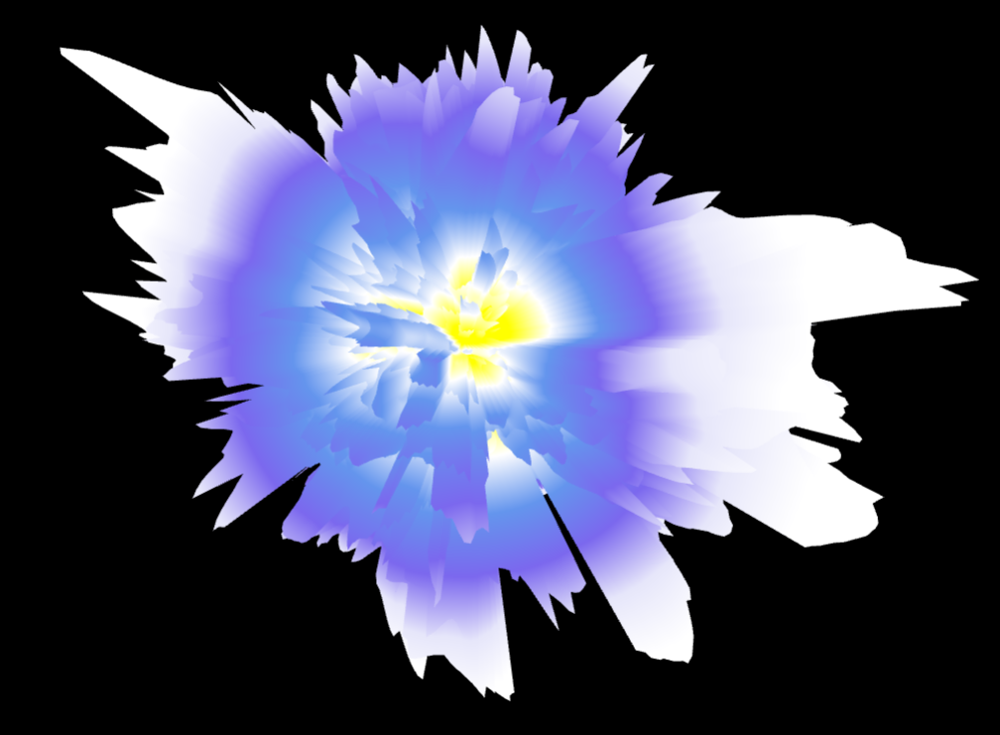
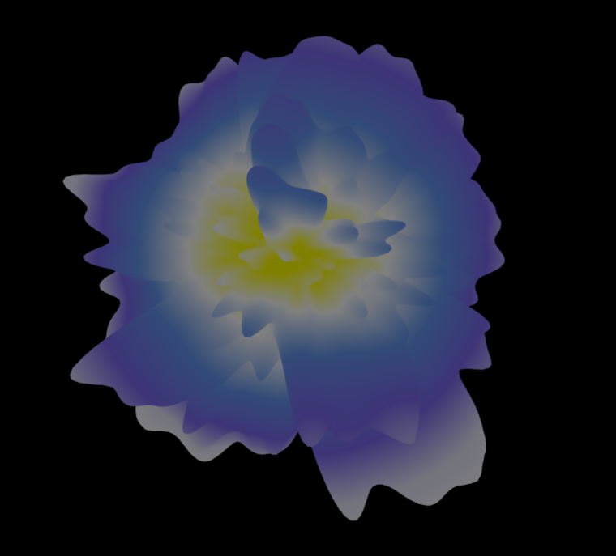
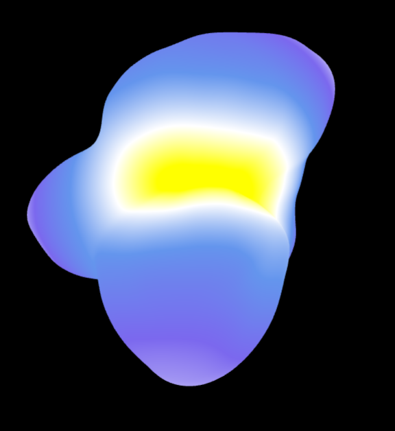
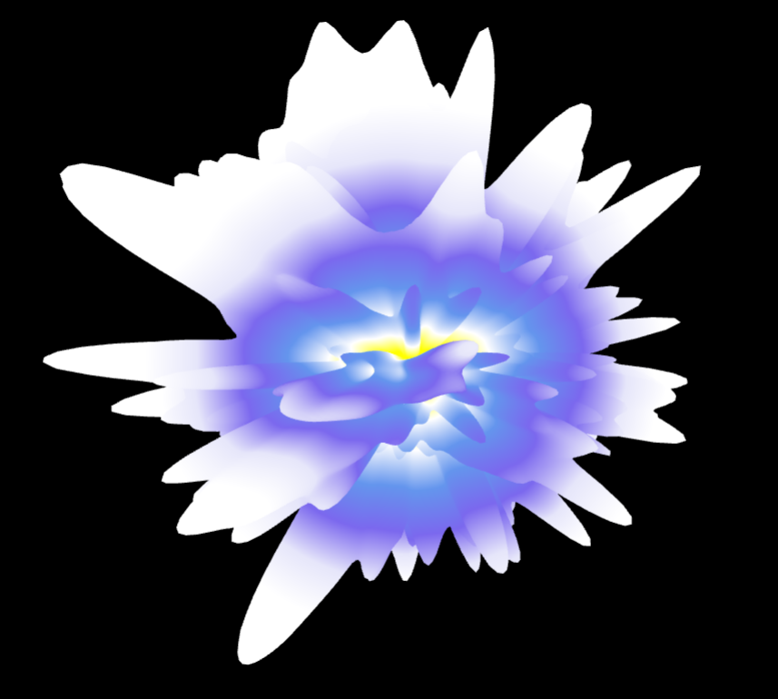

# [Project 1: Noise](https://github.com/CIS700-Procedural-Graphics/Project1-Noise)

## Tabatha Hickman

I created a pseudo-noise based animated cloud.

## Basic Geometry

The cloud started off as an icosahedron geometry with high detail so that I had a lrage amount of vertices to work with. Here it appears with each vertex's RGB value set as the surface normal.

## Generating 3D Noise

I then worked on generating 3D noise. I started with a simple, highly patterned function that took the sine of the dot product of a vector of a given x, y, z position and another vector with random numbers. I wrote an interpolation function that, given the position of a vertex, found the eight surrounding lattice points in 3D space around the given position, found noise values for those eight points, and trilinearly interpolated them (using cosine interpolation) to get a noise value for that vertex. Fianlly, in order to make the noise attravtive and interesting, I implemented a multi-octave noise generator, which found noise values at four different octaves with different frequencies and amplitudes, giving the noise randommness withouot getting too sporadic. 

After implementing the noise generation, I applied it to my geometry by adding the noise value to each vertex's position along the surface normal. The result from this, was the following.

I also decided to apply the noise values to the coloring of vertices. I created a gradient of colors such that depending on the magnitude of the noise value, the color would range from yellow to white to blue, interpolating smoothly in between.

This product appeared to have two major problems: There seemed to be stratification in the geometry around the axes, creating sharp cliffs in a voxelized form rather than smooth bumps that flowed into one another. Also, despite my multi-octave noise generation, the peaks were broad and flat rather than varied and multiple. 

The second problem was because I was incorrectly applying frequency to the noise generation. I was implementing it such that higher frequency caused the noise to sample from a narrower range, whereas it should've been a wider range. Fixing the frequency provided the result below:

There was still a voxelized stratification occurring and now the noise seemed very jagged and not as smooth and gradual as I had hoped. Both of these problems were caused by bugs in my interpolation code. I was accidentally not providing a t value between 0 and 1, as well as switching the low and high values that were being interpolated between. Once I fixed these problems and improved my noise function to multiply the sine decribed earlier by a large number and take the fractional component of that, I got the final product from above.

## GUI Sliders

I also created a few sliders using dat.GUI that affect the brightness of colors in the cloud and the persitence of the noise, which weakens or strengthens the noise values, basically affecting amplitude. 

These are lower and higher brightnesses than the final product above:

And these are lower and higher persitences than the final product above:

## Time-based Animation

Another thing I did was animate the noise on the cloud with respect to time. I wanted the cloud to bloom like a flower and then receed on a cycle of about two seconds. I did this by multiplying the offset from the noise by some value between 0 and 1 that was calculated based on the time. I didn't like how when the offset was multiplied by 0 it was a simple sphere, so I changed the value to range from 1/7 to 1. I also multiplied the position by a small fraction of the time before a noise value was taken from it so that the noise values continually changed for each vertex, creating a more lively cloud.    
